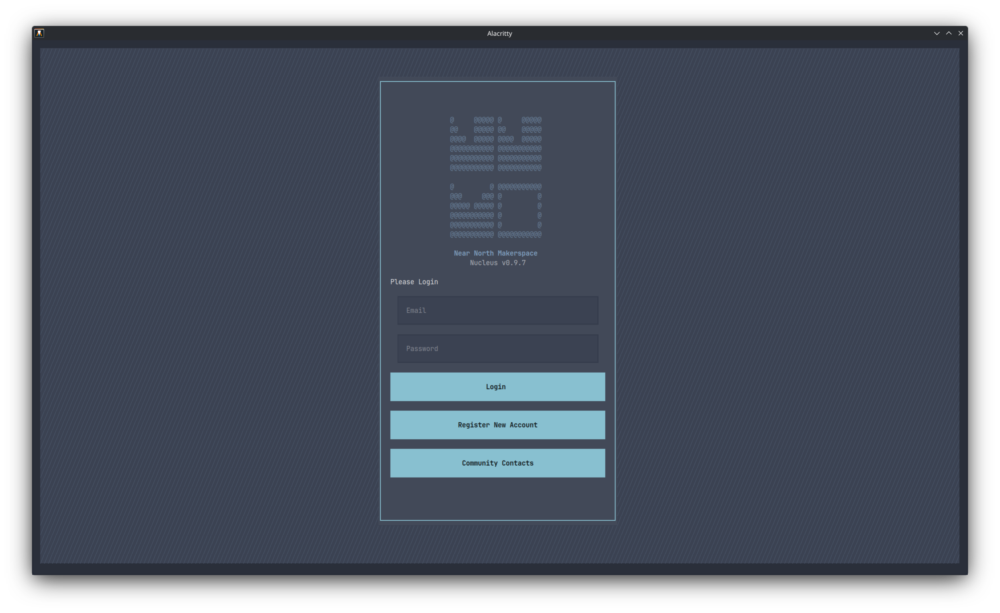
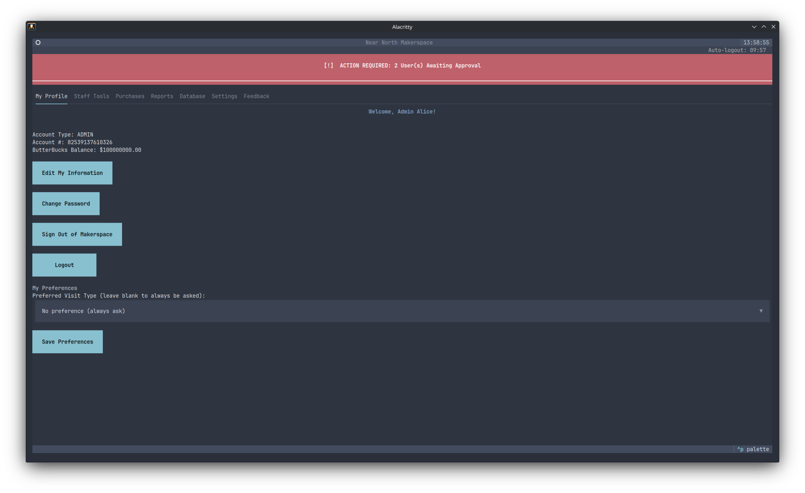
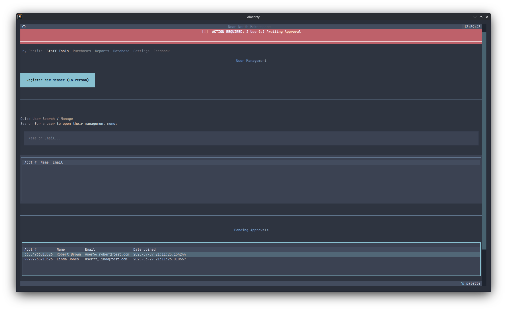

# Nucleus

A membership management application for hackerspaces and makerspaces.
Built with a fast-to-deploy terminal UI and a platform-agnostic core library
designed to support a future web frontend.

**Current version:** 0.9.77
**License:** AGPLv3

---

## Screenshots





---

## Features

- Member registration, approval, and profile management
- Membership tracking with automatic expiry and role downgrade
- Reusable membership and day pass tier templates with auto-fill pricing and credit grants
- Space sign-in and sign-out with visit type categorisation
- Post sign-in/out auto-logout with configurable countdown and cancel option
- Day pass and consumables/credits ledger with full transaction history
- Safety training records
- Member feedback with staff response
- Walk-in community contact form accessible without a member account
- Admin settings for runtime configuration (branding, security, operations, and more)
- Period Traction, Community Contacts, and full People data export reports (CSV and PDF)
- Daily membership summary email via Resend API
- Square Terminal integration for card and contactless payments
- Square recurring membership subscriptions with invoice-based billing
- Inventory cart for point-of-sale transactions
- Member storage unit tracking
- Manual cash transaction recording with audit trail
- Staff and Admin tools including raw SQL console
- Automated daily database backups

See [USER_MANUAL.md](USER_MANUAL.md) for full feature documentation and setup guides.

---

## Tech Stack

| Layer | Library |
|---|---|
| UI | Textual |
| ORM | SQLModel |
| Database | SQLite |
| Auth | passlib[bcrypt] |
| PDF Export | fpdf2 |
| Email Validation | email-validator |
| Email Delivery | resend |
| Point of Sale | squareup |

---

## Requirements

- Python 3.12
- See `requirements.txt` for all dependencies

---

## Installation

```bash
python -m venv venv
source venv/bin/activate      # Linux / macOS
# venv\Scripts\activate       # Windows
pip install -r requirements.txt
```

Copy `.env.example` to `.env` and set any environment-specific values before running.

---

## First-Time Setup

```bash
# Create the initial admin account
./scripts/create_admin.py

# (Optional) Seed test data for development
./scripts/seed_dummy_data.py
```

**Security:** Delete `create_admin.py`, `promote_superuser.py`, and `seed_dummy_data.py` from production installations after setup. Keep `update.py` and `poll_subscriptions.py` for ongoing maintenance.

---

## Running

```bash
# Standard
python nucleus.py

# Dev mode (Textual live reload + console)
textual run --dev nucleus.py
textual console
```

---

## Updating an Existing Installation

```bash
# Back up the database and apply pending schema migrations
./scripts/update.py
```

Run this script whenever pulling a new version. It creates a timestamped backup in `/backups/` and applies any pending column migrations automatically.

---

## Scripts

| Script | Purpose |
|---|---|
| `./scripts/create_admin.py` | Create the initial admin account |
| `./scripts/promote_superuser.py` | Promote an existing account to Admin |
| `./scripts/seed_dummy_data.py` | Seed test member data (development only) |
| `./scripts/update.py` | Back up and migrate an existing deployed database |
| `./scripts/poll_subscriptions.py` | Poll Square for current subscription status of all enrolled members |

---

## Project Structure

```
nucleus.py         Main app entry point (Textual App class)
core/              Business logic and database models (no UI dependencies)
screens/           Textual UI screens and modals
scripts/           Admin and setup utilities
theme/             CSS (.tcss), policy documents, and settings
backups/           Automated daily and pre-migration database backups
tests/             Pytest suite
```

---

## Database Migrations

Schema migrations run automatically on every app launch via `run_migrations()` in `core/database.py`. For production deployments, run `./scripts/update.py` before restarting the app to create a backup and ensure all migrations are applied.

When contributing new model columns, register them in `run_migrations()` using `_verify_and_add_column()`.

---

## License

This project is licensed under the [GNU Affero General Public License v3.0](LICENSE.md).
